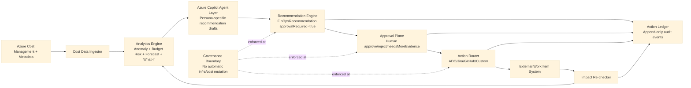

# Azure FinOps Starter

A governance-first starter for building an Azure Copilot-enabled, **AI-assisted, human-approved FinOps operating model** on Azure.

It is designed for teams that want to replace manual cost spreadsheets, ad-hoc review meetings, and inconsistent follow-up with a repeatable, auditable action loop.

---

## 1. What this project is

Azure FinOps Starter is a reference foundation for implementing:

1. cost signal detection,
2. recommendation generation with evidence,
3. human approval/authorization,
4. action routing into existing work systems,
5. outcome verification and audit logging.

It provides contracts, state logic, and governance boundaries so teams can integrate their own data pipelines and delivery tooling without losing control.

---

## Azure Copilot role in this solution

This solution uses Azure Copilot as the conversational and recommendation layer over FinOps signals.
Azure Copilot (with agent capability) is used to:

- summarize cost drivers and anomalies,
- generate evidence-backed recommendations,
- support persona-specific views (engineering, EM, FinOps, FP&A, procurement, exec),
- route approved actions into external work systems.

All consequential actions remain human-approved and are never auto-executed.

### Implementation mode (current, factual)

- **Supported today:** human-in-the-loop usage of Azure Copilot for cost analysis/recommendation drafting, then captured into this workflow.
- **Not assumed in default path:** an official public Azure Copilot API endpoint for direct custom app invocation.
- **If your tenant provides a supported endpoint:** this starter can plug it in through the client adapter layer.

### How Azure Copilot helps in this solution

Azure Copilot is the intelligence layer for turning raw cost signals into decision-ready guidance.

In this architecture, Azure Copilot helps by:

1. **Explaining cost signals in plain language**
   - Converts anomaly/budget/forecast signals into understandable narratives.

2. **Producing persona-specific recommendations**
   - Frames the same signal differently for engineering, EM, FinOps, FP&A, procurement, and executive audiences.

3. **Linking guidance to evidence**
   - Recommendations include evidence references so teams can verify the basis for the recommendation.

4. **Accelerating triage and ownership**
   - Suggests owner-ready actions that can be routed into ADO/Jira/GitHub/custom systems.

5. **Improving consistency of decision quality**
   - Standardizes recommendation framing and required decision context across teams.

### Important governance note

Azure Copilot in this solution is used for analysis and recommendation support — not autonomous execution.

All consequential actions are explicitly human-approved/authorized, and the following are never automatic:

- resource resizing/shutdowns
- budget or policy edits
- reservation/savings-plan purchases
- infrastructure mutations

---

## 2. Why this exists

Most organizations already have cost tools, but still struggle with operational execution:

- spend is reviewed too late,
- anomalies are identified but not owned,
- actions are tracked in multiple disconnected systems,
- approvals are inconsistent,
- outcomes are rarely measured and linked back to decisions.

This project exists to solve that gap between **insight** and **closed-loop action**.

### Value proposition

- **Faster decision cycles:** from monthly spreadsheet review to continuous triage
- **Higher accountability:** clear owner assignment and workflow state progression
- **Stronger governance:** explicit human approvals for consequential actions
- **Auditability by design:** append-only action ledger with traceable decisions
- **Tool flexibility:** integrate with ADO, Jira, GitHub, ServiceNow, or custom systems

---

## 3. Who this is for

- **FinOps leads** who need operational rigor, not just dashboards
- **Engineering managers and service owners** who need clear action ownership
- **FP&A / finance teams** who require explainable and auditable decision trails
- **Procurement/commercial teams** who need recommendation pipelines without automation risk
- **Platform teams** implementing governance-first cost operations

---

## 4. Non-negotiable governance boundary

This project is recommendation-first and human-governed.

The following are **never automatic**:

- resource resizing/shutdowns
- budget or policy edits
- reservation/savings-plan purchases
- any infrastructure mutation

Any consequential action requires explicit human approval/authorization.

---

## 5. What is already implemented

This repository currently includes a working core foundation:

### Contracts

- `contracts/recommendation.schema.json`
- `contracts/action-ledger-event.schema.json`

### Workflow core (TypeScript)

- deterministic action state machine
- approval decision mapping and enforcement
- human-governed action service
- append-only action ledger (in-memory and durable file-backed options)
- tool-agnostic router adapter interface
- Azure Copilot orchestration layer for persona-based recommendation drafting
- reference in-memory adapters for ADO/Jira/GitHub/ServiceNow/custom
- production API adapters for GitHub Issues, Jira, and Azure DevOps

### Specs and runbooks

- architecture specification with diagram
- router behavior contract
- governance boundary runbook
- Azure Copilot agent integration runbook
- tenant runtime wiring runbook

Current repository status: governance/workflow core, durable local ledger, and production tracker adapter implementations are implemented. Service hosting/API hardening remains in roadmap.

---

## 6. Universal action contract

The operating loop is centered on five action types:

1. Create/update action item
2. Assign/reassign owner
3. Post status comments
4. Change workflow state
5. Persist decisions/outcomes in action ledger

These five actions are intentionally system-agnostic so customers can integrate their own workflow platform directly.

---

## 7. End-to-end operating flow

1. **Detect**
   - ingest cost and metadata signals
   - identify anomaly/budget/forecast opportunities

2. **Recommend**
   - produce evidence-backed recommendation objects
   - include impact estimate and risk

3. **Approve**
   - capture human decision (`approve`, `reject`, `needsMoreEvidence`)
   - record approver identity, rationale, and timestamp

4. **Route**
   - create/update external work item
   - assign owner and set workflow state

5. **Re-check**
   - verify post-action impact
   - record measurable outcome and evidence

6. **Audit**
   - append every decision and outcome to ledger
   - preserve traceable history across systems

---

## 8. Architecture diagram



Detailed architecture notes are in `specs/v1-architecture.md`.

---

## 9. Quick start

### Prerequisites

- Node.js 18+
- npm 9+
- Git

### Build

```bash
npm install
npm run build
```

### Run demo (tenant-safe local mode)

```bash
npm run demo
```

Configure runtime via local environment variables (see `.env.example` and `runbooks/RB-02-tenant-runtime-wiring.md`).

### Output

Compiled artifacts are emitted to `dist/`.

---

## 10. Repository structure

```text
contracts/      JSON schemas for recommendations and action events
connectors/     External system adapter contracts
runbooks/       Governance and operating policies
specs/          Architecture, flow, and solution definition
src/            TypeScript workflow core
```

---

## 11. How to use this starter in practice

### Step 1 — Keep contracts stable

Use the provided JSON schemas as your source-of-truth event and recommendation contracts.

### Step 2 — Implement connector adapters

Implement adapter(s) for your existing platform:

- Azure DevOps work items
- Jira issues
- GitHub issues
- ServiceNow tickets
- custom webhook/internal system

### Step 3 — Add persistence

Replace or extend the in-memory ledger with durable storage (SQL/NoSQL/event store), while preserving append-only behavior.

### Step 4 — Wire ingest + analytics

Attach your cost ingestion and analytics stack so recommendation objects are generated from real data.

### Step 5 — Enforce approval policy

Ensure router operations requiring approval are blocked without a valid approval artifact.

### Step 6 — Operationalize

Run the loop on a schedule, monitor closure rates, and track realized post-action impact.

---

## 12. Current limitations

This repository currently does **not** include:

- production API service layer
- persistent database implementation
- full cost-ingest and analytics engine implementation
- role-specific UI/reporting packs

The project currently provides the governance and workflow foundation to build those layers safely.

---

## 13. Roadmap (next implementation layers)

1. adapter implementations for ADO/Jira/GitHub/custom webhook
2. approval API + persistent action ledger backend
3. ingest and analytics modules (cost/anomaly/budget/forecast)
4. role-specific report packs (engineering, EM, FinOps, FP&A, procurement, exec)
5. reference deployment templates

---

## 14. Design principles

- **Human authority over automation**
- **Deterministic evidence under AI narrative**
- **Strong audit trail over convenience shortcuts**
- **Tool-agnostic integration over vendor lock-in**
- **Operational closure over one-time insight**

---

## 15. License

MIT
