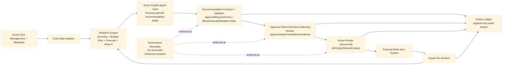

# Azure FinOps Starter

A governance-first starter for building an Azure Copilot-enabled, **AI-assisted, human-approved FinOps operating model** on Azure.

It is designed for teams that want to replace manual cost spreadsheets, ad-hoc review meetings, and inconsistent follow-up with a repeatable, auditable action loop.

---

## Start here (no jargon)

If you are a user, this is the flow:

1. You ask **Azure Copilot in Azure Portal** to analyze your cost signal.
2. Azure Copilot gives you recommendation text + evidence.
3. This starter turns that recommendation into a **governed action**:
   - approve/reject decision,
   - owner assignment,
   - work-item routing (ADO/Jira/GitHub),
   - audit ledger.
4. Nothing changes in Azure automatically. Human approval is required.

## Exactly where you call Azure Copilot

You call Azure Copilot in the **Azure Portal** (Cost Management context), not inside this repo by default.

Typical operator path:

1. Open Azure Portal.
2. Go to **Cost Management** scope (subscription/resource group/management group).
3. Open **Copilot** in that context.
4. Ask cost questions, for example:
   - "Why did compute cost spike this week?"
   - "What are the top cost drivers for this subscription?"
   - "Give me optimization actions with risk and expected impact."
5. Copy the recommendation summary/evidence into your operating workflow (this starter).

## Copilot-first FinOps operating system (not just prompts)

This project is meant to operationalize Cost Management work that a FinOps person/team does across the year.  
Azure Copilot is the analysis interface; this starter is the governed action system.

### Coverage map (what work is covered)

| Cadence | FinOps responsibility | Copilot role | This starter's role |
| --- | --- | --- | --- |
| Daily | anomaly triage, budget watch, owner follow-up | explain drivers, rank actions, highlight uncertainty | decision capture, routing, audit |
| Weekly | trend review, optimization backlog, forecast refresh | summarize drift, compare options, propose priorities | backlog state control, accountability trail |
| Monthly | close-cycle variance review, budget controls, commitment review | narrate variance, estimate impact bands, produce options | approval governance, ticket lifecycle, evidence ledger |
| Quarterly | commitment strategy, policy tuning, architecture optimization themes | scenario analysis and risk framing | controlled execution and measurable outcome tracking |
| Yearly | planning baseline, governance model review, KPI targets | historical synthesis and planning support | immutable history for planning and audit |

### Daily run (operator checklist)

1. Review new anomalies and budget-risk alerts in scope.
2. Ask Copilot for top drivers, confidence, and missing evidence.
3. Triage each item into one of:
   - `approve`
   - `reject`
   - `needsMoreEvidence`
4. Assign owner and due date for approved items.
5. Route to tracker (ADO/Jira/GitHub) and verify state transitions.
6. End-of-day: check unresolved high-risk items and stale approvals.

### Weekly run (operator checklist)

1. Review trend shifts (week-over-week, top service deltas, top workload deltas).
2. Re-prioritize optimization backlog by impact, risk, reversibility.
3. Refresh forecast confidence and budget-overrun risk.
4. Review `needsMoreEvidence` queue and close/advance aged items.
5. Publish weekly decision summary:
   - approved count,
   - rejected count,
   - pending evidence count,
   - expected vs realized impact.

### Monthly run (operator checklist)

1. Perform month-end variance narrative (actual vs forecast vs budget).
2. Review commitment opportunities (RI/SP candidates) with downside risk.
3. Validate chargeback/showback signal quality and missing tags/ownership gaps.
4. Confirm top recurring waste patterns and owners.
5. Produce month-end governance report with auditable evidence links.

### Quarterly run (operator checklist)

1. Reassess top optimization themes and platform engineering initiatives.
2. Evaluate policy/budget control efficacy and false-positive rate.
3. Revisit commitment strategy (coverage, utilization, regret risk).
4. Tune decision thresholds (what must always require escalation).
5. Publish quarter roadmap with owner-level accountability.

### Yearly run (operator checklist)

1. Build annual baseline from historical cost and driver seasonality.
2. Set KPI targets and governance thresholds for next cycle.
3. Review FinOps operating model and approval authority matrix.
4. Review toolchain gaps and automation roadmap.
5. Archive year-end evidence package for audit/executive planning.

## Advanced prompt library by FinOps task

### A) Daily anomaly triage prompts

1. "List today's top cost anomalies by business impact, with confidence and evidence references."
2. "For each anomaly, separate probable root cause vs uncertain hypotheses."
3. "Suggest the safest reversible first action for each item."
4. "Identify what additional evidence is required before approval."

### B) Budget risk prompts

1. "Given current run-rate, estimate month-end overshoot probability and confidence band."
2. "What 3 drivers contribute most to projected overrun?"
3. "Provide mitigation options ranked by savings vs delivery risk."

### C) Forecast quality prompts

1. "Compare current forecast against prior forecast and explain material drift."
2. "Which assumptions changed, and how sensitive is the forecast to each?"
3. "What evidence gaps reduce confidence?"

### D) Commitment prompts (RI/SP candidates)

1. "Identify stable baseline usage suitable for commitment discounts."
2. "Separate baseline from burst and quantify regret risk."
3. "Provide decision options with upside/downside scenarios."

### E) Rightsizing prompts

1. "Find top underutilized high-cost resources by workload."
2. "Rank candidates by expected savings, performance risk, rollback complexity."
3. "Output owner-ready actions with evidence references."

## Visuals and reporting capabilities (Copilot + Cost Management)

### What Azure Copilot can do for visuals

In Cost Management context, Azure Copilot can provide structured cost analysis responses (summaries, breakdowns, comparisons, forecasts, and supported simulations) in the portal experience.

- time-series cost summaries,
- service/meter/product breakdowns,
- month-to-month or period comparisons,
- forecast views,
- OpenAI usage cost simulations (where supported).

Use prompts like:

1. "Show a monthly cost trend for the last 6 months and highlight material jumps."
2. "Break down last month's costs by service and by meter."
3. "Compare this month vs last month by service and quantify top deltas."
4. "Forecast the next 3 months with confidence notes."

### What Azure Copilot can do for reports

Azure Copilot can produce report-ready narrative content:

- driver summary,
- top risks,
- prioritized options,
- expected impact and confidence,
- missing evidence and follow-up asks.

### What this starter adds for report quality

This starter converts Copilot analysis into governed report artifacts:

1. decision record (`approve` / `reject` / `needsMoreEvidence`),
2. owner and due-date accountability,
3. tracker linkage (ADO/Jira/GitHub),
4. immutable action/outcome audit trail.

### Weekly report pack (recommended)

- Top 10 anomalies with status and owner
- Approved vs rejected vs needsMoreEvidence counts
- Expected vs realized impact for closed items
- Forecast drift and confidence changes
- Escalations requiring leadership decisions

### Monthly report pack (recommended)

- Actual vs forecast vs budget narrative
- Recurring cost drivers and closure status
- Commitment option set with downside risk
- Control effectiveness (false positives / false negatives)
- Governance summary with evidence references

## Quality gate for Copilot output (must pass before action)

- Driver clarity: exact drivers and deltas identified.
- Evidence quality: references are traceable and relevant.
- Confidence: level stated with reason.
- Uncertainty: missing data and invalidation conditions listed.
- Safety: no autonomous mutation language.
- Actionability: owner-ready step is explicit.

If any gate fails, set `needsMoreEvidence`.

## Decision and escalation policy

- **Approve**: evidence is sufficient, risk accepted, owner assigned.
- **Reject**: recommendation invalid, low-value, or risk too high.
- **NeedsMoreEvidence**: missing data blocks safe decision.

Escalate when any of these are true:
- high financial impact with low confidence,
- recommendation implies policy/budget/commitment change,
- cross-team ownership conflict,
- repeated recurrence without root-cause closure.

## What this starter adds that Learn docs do not

Learn helps users ask better Copilot questions.  
This starter adds the execution layer:

1. enforce approval policy,
2. convert recommendation to tracked action,
3. assign owner and workflow state,
4. preserve immutable decision/outcome audit history,
5. measure realized impact after action closure.

## Detailed reporting outputs (Excel + Power BI datafiles)

Yes, this solution supports detailed reporting workflows beyond visual chat responses.

### Reporting path A — Power BI direct connector (where supported)

Use the Microsoft Cost Management connector in Power BI Desktop for supported agreements/scopes.  
Use this only where agreement/scope support is confirmed in your tenant (for example direct MCA/EA support as documented by Microsoft).

### Reporting path B — Export-based datafiles (recommended baseline)

Use Cost Management Exports to Azure Storage (CSV/Parquet/FOCUS), then build:

- Excel workbooks (`.xlsx`) for operational packs,
- Power BI models (`.pbix`) for dashboards and executive reporting.

Azure Copilot does not directly export .xlsx or .pbix files from chat; those are produced through Excel/Power BI using Cost Management data sources.

This path is stable for large/historical datasets and works well with governance workflows.

### How this starter connects to reporting

Copilot produces analysis and decision context.  
This starter adds action governance and ledger events.  
Reports should combine:

1. Cost data (from Cost Management exports),
2. Decision/action data (from action ledger),
3. Outcome evidence (post-action re-check).

For full setup, see `runbooks/RB-04-excel-powerbi-reporting.md`.

For full role-by-role and cadence-by-cadence operating procedures, see:
`runbooks/RB-03-finops-operating-system.md`

## What this repo does today vs later

| Mode | What happens |
| --- | --- |
| **Today (default)** | Human uses Azure Copilot in portal, then this starter governs approval/routing/audit. |
| **Later (tenant-dependent)** | If your tenant exposes supported programmatic access, the same governance flow can call through an adapter. |

---

## 1. What this project is

Azure FinOps Starter is a reference foundation for implementing:

1. cost signal detection,
2. recommendation generation with evidence,
3. human approval/authorization,
4. action routing into existing work systems,
5. outcome verification and audit logging.

It provides contracts, state logic, and governance boundaries so teams can integrate their own data pipelines and delivery tooling without losing control.

---

## Azure Copilot + Azure Copilot Agent role in this solution

This solution is intentionally split into two planes:

1. **Intelligence interface (Azure Copilot + Azure Copilot Agent)**
   - explains cost drivers and anomalies,
   - drafts evidence-backed recommendations,
   - frames outputs for role-specific consumers.
2. **Runtime authority (orchestration in this starter)**
   - enforces policy,
   - requires explicit human approval for consequential actions,
   - routes approved actions,
   - records auditable outcomes.

In short: Azure Copilot Agent provides the Cost Management intelligence; this starter enforces the governance and execution boundary.

Azure Copilot (with agent capability) is used to:

- summarize cost drivers and anomalies,
- generate evidence-backed recommendations,
- support persona-specific views (engineering, EM, FinOps, FP&A, procurement, exec),
- hand off approved actions to external work systems through governed adapters.

All consequential actions remain human-approved and are never auto-executed.

### Consequential action definition

In this project, a consequential action is any operation that can change cloud cost posture or runtime state, including:

- resource resizing/shutdown
- budget or policy edits
- reservation/savings-plan purchases
- any infrastructure mutation

These actions are recommendation-only until explicit human approval/authorization is captured.

### Capability truth table (current, factual)

| Capability | Status |
| --- | --- |
| Human-in-the-loop Azure Copilot Cost Management analysis and recommendation drafting | **Live now** |
| Governance enforcement (`approvalRequired=true`, `allowAutomaticMutation=false`) | **Live now** |
| Routing approved actions to ADO/Jira/GitHub via adapters | **Live now** |
| Direct programmatic Azure Copilot endpoint invocation from custom runtime | **Tenant-dependent** |
| Automatic consequential mutation (infra/cost changes) | **Not supported by design** |

### How Azure Copilot helps in this solution

Azure Copilot is the intelligence layer for turning raw cost signals into decision-ready guidance.

In this architecture, Azure Copilot helps by:

1. **Explaining cost signals in plain language**
   - Converts anomaly/budget/forecast signals into understandable narratives.

2. **Producing persona-specific recommendations**
   - Frames the same signal differently for engineering, EM, FinOps, FP&A, procurement, and executive audiences.

3. **Linking guidance to evidence**
   - Recommendations include evidence references so teams can verify the basis for the recommendation.

4. **Accelerating triage and ownership**
   - Suggests owner-ready actions that can be routed into ADO/Jira/GitHub/custom systems.

5. **Improving consistency of decision quality**
   - Standardizes recommendation framing and required decision context across teams.

### Important governance note

Azure Copilot in this solution is used for analysis and recommendation support — not autonomous execution.

All consequential actions are explicitly human-approved/authorized, and the following are never automatic:

- resource resizing/shutdowns
- budget or policy edits
- reservation/savings-plan purchases
- infrastructure mutations

---

## 2. Why this exists

Most organizations already have cost tools, but still struggle with operational execution:

- spend is reviewed too late,
- anomalies are identified but not owned,
- actions are tracked in multiple disconnected systems,
- approvals are inconsistent,
- outcomes are rarely measured and linked back to decisions.

This project exists to solve that gap between **insight** and **closed-loop action**.

### Value proposition

- **Faster decision cycles:** from monthly spreadsheet review to continuous triage
- **Higher accountability:** clear owner assignment and workflow state progression
- **Stronger governance:** explicit human approvals for consequential actions
- **Auditability by design:** append-only action ledger with traceable decisions
- **Tool flexibility:** integrate with ADO, Jira, GitHub, ServiceNow, or custom systems

---

## 3. Who this is for

- **FinOps leads** who need operational rigor, not just dashboards
- **Engineering managers and service owners** who need clear action ownership
- **FP&A / finance teams** who require explainable and auditable decision trails
- **Procurement/commercial teams** who need recommendation pipelines without automation risk
- **Platform teams** implementing governance-first cost operations

---

## 4. Non-negotiable governance boundary

This project is recommendation-first and human-governed.

The following are **never automatic**:

- resource resizing/shutdowns
- budget or policy edits
- reservation/savings-plan purchases
- any infrastructure mutation

Any consequential action requires explicit human approval/authorization.
LLM output is advisory until it passes deterministic policy checks and approval gating.

---

## 5. What is already implemented

This repository currently includes a working core foundation:

### Contracts

- `contracts/recommendation.schema.json`
- `contracts/action-ledger-event.schema.json`

### Workflow core (TypeScript)

- deterministic action state machine
- approval decision mapping and enforcement
- human-governed action service
- append-only action ledger (in-memory and durable file-backed options)
- tool-agnostic router adapter interface
- Azure Copilot orchestration layer for persona-based recommendation drafting
- reference in-memory adapters for ADO/Jira/GitHub/ServiceNow/custom
- production API adapters for GitHub Issues, Jira, and Azure DevOps

### Specs and runbooks

- architecture specification with diagram
- router behavior contract
- governance boundary runbook
- Azure Copilot agent integration runbook
- tenant runtime wiring runbook

Current repository status: governance/workflow core, durable local ledger, and production tracker adapter implementations are implemented. Service hosting/API hardening remains in roadmap.

---

## 6. Universal action contract

The operating loop is centered on five action types:

1. Create/update action item
2. Assign/reassign owner
3. Post status comments
4. Change workflow state
5. Persist decisions/outcomes in action ledger

These five actions are intentionally system-agnostic so customers can integrate their own workflow platform directly.

---

## 7. End-to-end operating flow

1. **Detect**
   - ingest cost and metadata signals
   - identify anomaly/budget/forecast opportunities

2. **Recommend**
   - produce evidence-backed recommendation objects
   - include impact estimate and risk

3. **Approve**
   - capture human decision (`approve`, `reject`, `needsMoreEvidence`)
   - record approver identity, rationale, and timestamp

4. **Route**
   - create/update external work item
   - assign owner and set workflow state

5. **Re-check**
   - verify post-action impact
   - record measurable outcome and evidence

6. **Audit**
   - append every decision and outcome to ledger
   - preserve traceable history across systems

---

## 8. Architecture diagram



Detailed architecture notes are in `specs/v1-architecture.md`.

---

## 9. Quick start (5-minute user walkthrough)

### Prerequisites

- Node.js 18+
- npm 9+
- Git

### Step 1 — run the starter locally

```bash
npm install
npm run build
npm run demo
```

What you will see:
- one sample cost signal,
- one recommendation-to-action lifecycle,
- approval + state transitions,
- audit events written to `data/action-ledger.jsonl`.

### Step 2 — use Azure Copilot for real analysis

In Azure Portal Cost Management, ask Copilot your real cost questions (spike, forecast risk, optimization options), then capture its recommendation/evidence.

### Step 3 — run the same governance flow on that recommendation

Use this starter to enforce:
- explicit human decision (`approve`/`reject`/`needsMoreEvidence`),
- owner assignment and routing,
- immutable audit trail.

### Step 4 — connect your tracker and tenant config

Set `.env` locally (do not commit it), then choose routing mode:
- `TRACKER_MODE=memory` (local)
- `TRACKER_MODE=github`
- `TRACKER_MODE=jira`
- `TRACKER_MODE=ado`

See: `.env.example` and `runbooks/RB-02-tenant-runtime-wiring.md`.

### Important current behavior

`npm run demo` uses a deterministic local recommendation client for reproducible testing.  
It does **not** directly invoke Azure Copilot endpoint APIs in the default path.

---

## 10. Repository structure

```text
contracts/      JSON schemas for recommendations and action events
connectors/     External system adapter contracts
runbooks/       Governance and operating policies
specs/          Architecture, flow, and solution definition
src/            TypeScript workflow core
```

---

## 11. How to use this starter in practice

### Step 1 — Keep contracts stable

Use the provided JSON schemas as your source-of-truth event and recommendation contracts.

### Step 2 — Implement connector adapters

Implement adapter(s) for your existing platform:

- Azure DevOps work items
- Jira issues
- GitHub issues
- ServiceNow tickets
- custom webhook/internal system

### Step 3 — Add persistence

Replace or extend the in-memory ledger with durable storage (SQL/NoSQL/event store), while preserving append-only behavior.

### Step 4 — Wire ingest + analytics

Attach your cost ingestion and analytics stack so recommendation objects are generated from real data.

### Step 5 — Enforce approval policy

Ensure router operations requiring approval are blocked without a valid approval artifact.

### Step 6 — Operationalize

Run the loop on a schedule, monitor closure rates, and track realized post-action impact.

---

## 12. Current limitations

This repository currently does **not** include:

- production API service layer
- persistent database implementation
- full cost-ingest and analytics engine implementation
- role-specific UI/reporting packs

The project currently provides the governance and workflow foundation to build those layers safely.

---

## 13. Roadmap (next implementation layers)

1. adapter implementations for ADO/Jira/GitHub/custom webhook
2. approval API + persistent action ledger backend
3. ingest and analytics modules (cost/anomaly/budget/forecast)
4. role-specific report packs (engineering, EM, FinOps, FP&A, procurement, exec)
5. reference deployment templates

---

## 14. Design principles

- **Human authority over automation**
- **Deterministic evidence under AI narrative**
- **Strong audit trail over convenience shortcuts**
- **Tool-agnostic integration over vendor lock-in**
- **Operational closure over one-time insight**

---

## 15. License

MIT
