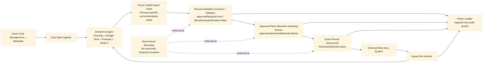

# Azure FinOps Starter

A governance-first starter for building an Azure Copilot-enabled, **AI-assisted, human-approved FinOps operating model** on Azure.

It is designed for teams that want to replace manual cost spreadsheets, ad-hoc review meetings, and inconsistent follow-up with a repeatable, auditable action loop.

---

## Start here (no jargon)

If you are a user, this is the flow:

1. You ask **Azure Copilot in Azure Portal** to analyze your cost signal.
2. Azure Copilot gives you recommendation text + evidence.
3. This starter turns that recommendation into a **governed action**:
   - approve/reject decision,
   - owner assignment,
   - work-item routing (ADO/Jira/GitHub),
   - audit ledger.
4. Nothing changes in Azure automatically. Human approval is required.

## Exactly where you call Azure Copilot

You call Azure Copilot in the **Azure Portal** (Cost Management context), not inside this repo by default.

Typical operator path:

1. Open Azure Portal.
2. Go to **Cost Management** scope (subscription/resource group/management group).
3. Open **Copilot** in that context.
4. Ask cost questions, for example:
   - "Why did compute cost spike this week?"
   - "What are the top cost drivers for this subscription?"
   - "Give me optimization actions with risk and expected impact."
5. Copy the recommendation summary/evidence into your operating workflow (this starter).

## Advanced Azure Copilot Cost Management playbook (practical)

Use these prompt packs directly in Azure Copilot (Cost Management context).  
Each pack is designed to produce decision-ready output you can move into this starter.

### 1) Cost spike triage (anomaly)

**Prompt pack**
1. "Show the top 5 cost drivers for the last 7 days vs previous 7 days for this scope."
2. "Break each driver by service, meter/category, and workload tag if available."
3. "For each driver, tell me likely cause, confidence, and missing data that could change the conclusion."
4. "Give me actions ranked by impact, risk, and reversibility."

**What good output looks like**
- Names the exact drivers and deltas (not generic statements).
- Includes confidence and uncertainty.
- Separates reversible actions from high-risk actions.
- Provides evidence references you can trace.

### 2) Budget risk early warning

**Prompt pack**
1. "Based on current run-rate, what is the month-end projection for this budget scope?"
2. "What is the confidence band for that forecast and why?"
3. "What are the top contributors to projected overrun?"
4. "Give me 3 mitigation actions with expected savings and execution risk."

**What good output looks like**
- Forecast is tied to explicit run-rate logic.
- Confidence is explained, not implied.
- Mitigations include estimated impact and risk.

### 3) Commitment opportunity check (Reservations/Savings Plan candidates)

**Prompt pack**
1. "Identify stable usage patterns in the last 30-90 days that may qualify for commitment discounts."
2. "Separate stable baseline from burst usage."
3. "Estimate upside and downside risk if usage drops."
4. "Recommend decision options for procurement review (no auto-purchase)."

**What good output looks like**
- Distinguishes baseline vs burst clearly.
- Shows downside risk and commitment regret risk.
- Ends with recommendation options, not automatic action.

### 4) Rightsizing candidate review

**Prompt pack**
1. "Find top compute/storage/network cost contributors with low utilization signals."
2. "List rightsizing candidates with expected savings, performance risk, and rollback complexity."
3. "Prioritize candidates by net benefit and operational safety."
4. "Output owner-ready actions."

**What good output looks like**
- Candidate list includes risk and rollback plan expectation.
- Prioritization is explicit and reasoned.
- Output is assignable to owners.

## Copilot response quality gate (before you approve anything)

Use this checklist before moving to action:

- Evidence references are present and relevant.
- Confidence is stated.
- Uncertainty/missing data is called out.
- Proposed action is reversible or has rollback path.
- No autonomous mutation language.
- Human decision required is explicit.

If any item is missing, mark `needsMoreEvidence` and request refinement in Copilot.

## Role view: what each team should ask Copilot to produce

| Role | Ask Copilot for | Must include |
| --- | --- | --- |
| FinOps | cost driver narrative + ranked options | impact estimate, confidence, evidence |
| Engineering Manager | owner-ready execution plan | owner mapping, delivery risk, rollback note |
| FP&A | budget/forecast implication | variance narrative, confidence band |
| Procurement | commitment decision support | upside/downside risk, option set |
| Executive | decision summary | top risk, decision needed, expected impact |

## From Copilot answer to governed action (this starter's value)

This project adds value after Copilot by enforcing:

1. decision capture (`approve` / `reject` / `needsMoreEvidence`),
2. owner assignment,
3. ticket routing (ADO/Jira/GitHub),
4. immutable audit trail.

### Decision template (copy/paste)

```json
{
  "decision": "approve",
  "approverId": "<name-or-id>",
  "rationale": "<why this action is approved>",
  "ownerId": "<team-or-user>",
  "requiredEvidence": [
    "<evidence-ref-1>",
    "<evidence-ref-2>"
  ]
}
```

## Weekly operating cadence (simple and effective)

- **Daily (10-15 min):** anomaly triage + owner assignment.
- **Twice weekly:** follow up `needsMoreEvidence` items.
- **Weekly:** closed-loop review (approved vs realized impact).
- **Monthly:** commitment opportunity checkpoint with procurement/finance.

## What this repo does today vs later

| Mode | What happens |
| --- | --- |
| **Today (default)** | Human uses Azure Copilot in portal, then this starter governs approval/routing/audit. |
| **Later (tenant-dependent)** | If your tenant exposes supported programmatic access, the same governance flow can call through an adapter. |

---

## 1. What this project is

Azure FinOps Starter is a reference foundation for implementing:

1. cost signal detection,
2. recommendation generation with evidence,
3. human approval/authorization,
4. action routing into existing work systems,
5. outcome verification and audit logging.

It provides contracts, state logic, and governance boundaries so teams can integrate their own data pipelines and delivery tooling without losing control.

---

## Azure Copilot + Azure Copilot Agent role in this solution

This solution is intentionally split into two planes:

1. **Intelligence interface (Azure Copilot + Azure Copilot Agent)**
   - explains cost drivers and anomalies,
   - drafts evidence-backed recommendations,
   - frames outputs for role-specific consumers.
2. **Runtime authority (orchestration in this starter)**
   - enforces policy,
   - requires explicit human approval for consequential actions,
   - routes approved actions,
   - records auditable outcomes.

In short: Azure Copilot Agent provides the Cost Management intelligence; this starter enforces the governance and execution boundary.

Azure Copilot (with agent capability) is used to:

- summarize cost drivers and anomalies,
- generate evidence-backed recommendations,
- support persona-specific views (engineering, EM, FinOps, FP&A, procurement, exec),
- hand off approved actions to external work systems through governed adapters.

All consequential actions remain human-approved and are never auto-executed.

### Consequential action definition

In this project, a consequential action is any operation that can change cloud cost posture or runtime state, including:

- resource resizing/shutdown
- budget or policy edits
- reservation/savings-plan purchases
- any infrastructure mutation

These actions are recommendation-only until explicit human approval/authorization is captured.

### Capability truth table (current, factual)

| Capability | Status |
| --- | --- |
| Human-in-the-loop Azure Copilot Cost Management analysis and recommendation drafting | **Live now** |
| Governance enforcement (`approvalRequired=true`, `allowAutomaticMutation=false`) | **Live now** |
| Routing approved actions to ADO/Jira/GitHub via adapters | **Live now** |
| Direct programmatic Azure Copilot endpoint invocation from custom runtime | **Tenant-dependent** |
| Automatic consequential mutation (infra/cost changes) | **Not supported by design** |

### How Azure Copilot helps in this solution

Azure Copilot is the intelligence layer for turning raw cost signals into decision-ready guidance.

In this architecture, Azure Copilot helps by:

1. **Explaining cost signals in plain language**
   - Converts anomaly/budget/forecast signals into understandable narratives.

2. **Producing persona-specific recommendations**
   - Frames the same signal differently for engineering, EM, FinOps, FP&A, procurement, and executive audiences.

3. **Linking guidance to evidence**
   - Recommendations include evidence references so teams can verify the basis for the recommendation.

4. **Accelerating triage and ownership**
   - Suggests owner-ready actions that can be routed into ADO/Jira/GitHub/custom systems.

5. **Improving consistency of decision quality**
   - Standardizes recommendation framing and required decision context across teams.

### Important governance note

Azure Copilot in this solution is used for analysis and recommendation support — not autonomous execution.

All consequential actions are explicitly human-approved/authorized, and the following are never automatic:

- resource resizing/shutdowns
- budget or policy edits
- reservation/savings-plan purchases
- infrastructure mutations

---

## 2. Why this exists

Most organizations already have cost tools, but still struggle with operational execution:

- spend is reviewed too late,
- anomalies are identified but not owned,
- actions are tracked in multiple disconnected systems,
- approvals are inconsistent,
- outcomes are rarely measured and linked back to decisions.

This project exists to solve that gap between **insight** and **closed-loop action**.

### Value proposition

- **Faster decision cycles:** from monthly spreadsheet review to continuous triage
- **Higher accountability:** clear owner assignment and workflow state progression
- **Stronger governance:** explicit human approvals for consequential actions
- **Auditability by design:** append-only action ledger with traceable decisions
- **Tool flexibility:** integrate with ADO, Jira, GitHub, ServiceNow, or custom systems

---

## 3. Who this is for

- **FinOps leads** who need operational rigor, not just dashboards
- **Engineering managers and service owners** who need clear action ownership
- **FP&A / finance teams** who require explainable and auditable decision trails
- **Procurement/commercial teams** who need recommendation pipelines without automation risk
- **Platform teams** implementing governance-first cost operations

---

## 4. Non-negotiable governance boundary

This project is recommendation-first and human-governed.

The following are **never automatic**:

- resource resizing/shutdowns
- budget or policy edits
- reservation/savings-plan purchases
- any infrastructure mutation

Any consequential action requires explicit human approval/authorization.
LLM output is advisory until it passes deterministic policy checks and approval gating.

---

## 5. What is already implemented

This repository currently includes a working core foundation:

### Contracts

- `contracts/recommendation.schema.json`
- `contracts/action-ledger-event.schema.json`

### Workflow core (TypeScript)

- deterministic action state machine
- approval decision mapping and enforcement
- human-governed action service
- append-only action ledger (in-memory and durable file-backed options)
- tool-agnostic router adapter interface
- Azure Copilot orchestration layer for persona-based recommendation drafting
- reference in-memory adapters for ADO/Jira/GitHub/ServiceNow/custom
- production API adapters for GitHub Issues, Jira, and Azure DevOps

### Specs and runbooks

- architecture specification with diagram
- router behavior contract
- governance boundary runbook
- Azure Copilot agent integration runbook
- tenant runtime wiring runbook

Current repository status: governance/workflow core, durable local ledger, and production tracker adapter implementations are implemented. Service hosting/API hardening remains in roadmap.

---

## 6. Universal action contract

The operating loop is centered on five action types:

1. Create/update action item
2. Assign/reassign owner
3. Post status comments
4. Change workflow state
5. Persist decisions/outcomes in action ledger

These five actions are intentionally system-agnostic so customers can integrate their own workflow platform directly.

---

## 7. End-to-end operating flow

1. **Detect**
   - ingest cost and metadata signals
   - identify anomaly/budget/forecast opportunities

2. **Recommend**
   - produce evidence-backed recommendation objects
   - include impact estimate and risk

3. **Approve**
   - capture human decision (`approve`, `reject`, `needsMoreEvidence`)
   - record approver identity, rationale, and timestamp

4. **Route**
   - create/update external work item
   - assign owner and set workflow state

5. **Re-check**
   - verify post-action impact
   - record measurable outcome and evidence

6. **Audit**
   - append every decision and outcome to ledger
   - preserve traceable history across systems

---

## 8. Architecture diagram



Detailed architecture notes are in `specs/v1-architecture.md`.

---

## 9. Quick start (5-minute user walkthrough)

### Prerequisites

- Node.js 18+
- npm 9+
- Git

### Step 1 — run the starter locally

```bash
npm install
npm run build
npm run demo
```

What you will see:
- one sample cost signal,
- one recommendation-to-action lifecycle,
- approval + state transitions,
- audit events written to `data/action-ledger.jsonl`.

### Step 2 — use Azure Copilot for real analysis

In Azure Portal Cost Management, ask Copilot your real cost questions (spike, forecast risk, optimization options), then capture its recommendation/evidence.

### Step 3 — run the same governance flow on that recommendation

Use this starter to enforce:
- explicit human decision (`approve`/`reject`/`needsMoreEvidence`),
- owner assignment and routing,
- immutable audit trail.

### Step 4 — connect your tracker and tenant config

Set `.env` locally (do not commit it), then choose routing mode:
- `TRACKER_MODE=memory` (local)
- `TRACKER_MODE=github`
- `TRACKER_MODE=jira`
- `TRACKER_MODE=ado`

See: `.env.example` and `runbooks/RB-02-tenant-runtime-wiring.md`.

### Important current behavior

`npm run demo` uses a deterministic local recommendation client for reproducible testing.  
It does **not** directly invoke Azure Copilot endpoint APIs in the default path.

---

## 10. Repository structure

```text
contracts/      JSON schemas for recommendations and action events
connectors/     External system adapter contracts
runbooks/       Governance and operating policies
specs/          Architecture, flow, and solution definition
src/            TypeScript workflow core
```

---

## 11. How to use this starter in practice

### Step 1 — Keep contracts stable

Use the provided JSON schemas as your source-of-truth event and recommendation contracts.

### Step 2 — Implement connector adapters

Implement adapter(s) for your existing platform:

- Azure DevOps work items
- Jira issues
- GitHub issues
- ServiceNow tickets
- custom webhook/internal system

### Step 3 — Add persistence

Replace or extend the in-memory ledger with durable storage (SQL/NoSQL/event store), while preserving append-only behavior.

### Step 4 — Wire ingest + analytics

Attach your cost ingestion and analytics stack so recommendation objects are generated from real data.

### Step 5 — Enforce approval policy

Ensure router operations requiring approval are blocked without a valid approval artifact.

### Step 6 — Operationalize

Run the loop on a schedule, monitor closure rates, and track realized post-action impact.

---

## 12. Current limitations

This repository currently does **not** include:

- production API service layer
- persistent database implementation
- full cost-ingest and analytics engine implementation
- role-specific UI/reporting packs

The project currently provides the governance and workflow foundation to build those layers safely.

---

## 13. Roadmap (next implementation layers)

1. adapter implementations for ADO/Jira/GitHub/custom webhook
2. approval API + persistent action ledger backend
3. ingest and analytics modules (cost/anomaly/budget/forecast)
4. role-specific report packs (engineering, EM, FinOps, FP&A, procurement, exec)
5. reference deployment templates

---

## 14. Design principles

- **Human authority over automation**
- **Deterministic evidence under AI narrative**
- **Strong audit trail over convenience shortcuts**
- **Tool-agnostic integration over vendor lock-in**
- **Operational closure over one-time insight**

---

## 15. License

MIT
