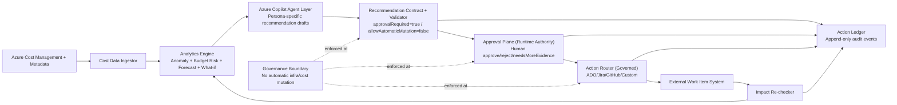

# V1 Architecture — Azure Copilot FinOps Starter

## Goal

Deliver a high-capability FinOps loop with strict human governance:

- Broad recommendations across cost, anomaly, budget, forecast, and commitment opportunities
- Zero autonomous infrastructure/cost mutation
- Explicit human approval/authorization for all consequential actions

## Core principles

1. Recommendation-first, human-authorized execution
2. Tool-agnostic workflow (ADO/Jira/GitHub/custom)
3. Deterministic evidence + auditable AI narrative
4. Full decision/outcome ledger
5. Re-check loop to measure impact

## Authority split (explicit)

1. **Intelligence interface:** Azure Copilot + Azure Copilot Agent interpret Cost Management signals and draft recommendations.
2. **Runtime authority:** this starter validates policy, enforces human approval, routes actions, and records audit evidence.

Model output is never treated as an executable command by default.

## V1 system components

1. **Cost Data Ingestor**
   - Pulls Cost Management and related metadata
   - Normalizes scope, service, and owner dimensions

2. **Analytics Engine**
   - Anomaly detection
   - Budget risk checks
   - Forecast and what-if simulation wrappers

3. **Azure Copilot Agent Layer**
   - Consumes FinOps signals and evidence references
   - Produces persona-specific recommendation narratives
   - Enforces recommendation-only posture (`allowAutomaticMutation=false`)

4. **Recommendation Contract + Validator**
   - Emits `FinOpsRecommendation` documents
   - Includes evidence references and impact estimate
   - Always sets `approvalRequired = true`
   - Rejects responses that violate `allowAutomaticMutation=false`

5. **Approval Plane (Runtime Authority)**
   - Human approve/reject/needsMoreEvidence
   - Captures rationale and approver identity

6. **Action Router (Governed)**
   - Creates/updates work items in customer tooling
   - Assigns/reassigns owners
   - Posts status comments
   - Transitions workflow states

7. **Action Ledger**
   - Append-only event stream (`ActionLedgerEvent`)
   - Durable audit trail for recommendation -> decision -> outcome

8. **Impact Re-checker**
   - Re-evaluates cost behavior after action resolution
   - Records outcome evidence

## Architecture diagram

## State model

`new -> triaged -> approved/authorized -> inProgress -> resolved -> closed`

Alternative paths:

- `new -> dismissed`
- `triaged -> needsMoreEvidence -> triaged`

## Non-goals (hard boundary)

V1 does not auto-execute:

- resource resizing/shutdowns
- budget/policy edits
- reservation/savings-plan purchases
- any infrastructure mutation

## Consequential action definition

Any operation that can change cost posture or runtime state is consequential and must remain human-authorized. This includes the four non-goal categories above.

## Success metrics

1. Time-to-insight reduction
2. Recommendation acceptance rate
3. Action closure rate
4. Measured post-action impact coverage
5. Audit completeness (100% action events logged)
